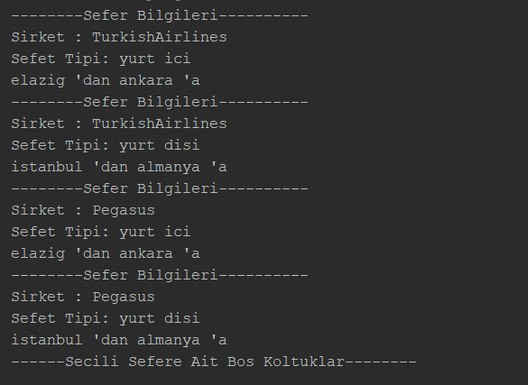
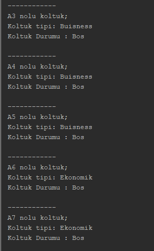
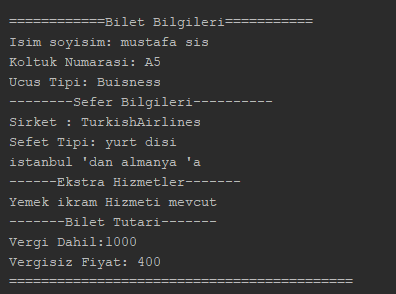

# Mustafa Sis 
### 1.haftanin odevleri
* Atm.java  
    * [kaynak kod icin tiklayiniz](https://github.com/K150-JavaBootcampClassroom/k150-sismustafa/blob/main/week1/Atm.java)
* RandomSayi.java
    * [kaynak kod icin tiklayiniz](https://github.com/K150-JavaBootcampClassroom/k150-sismustafa/blob/main/week1/RandomSayi.java)

### 2.haftanin odevi
    
* odevde bulunan bazi ozellikler
    * mail ve sifre ile giris yapma
    * Musteriler 'Customer' Interface ile olusturulmus iki alt siniftan olusturuldu. Musteri giris yaptiktan sonra menu ekrani ile karsilasmakta
    * Menu 2 secenekten olusmaktadir (genisletilebilinir)
        * **Araba kirala menusu;** arabalari listeleme ve listelenen araclara gore arac kiralama ekranina yonlenlendirmektedir.
        * **Bilgileri Listeleme menusu;** Kullanici bilgilerini ve eger kiralanmis bir arac mevcut ise onun bilgilerini listelemek icin kullanilir.
    * Kiralanan araclar farkli bir kullanici girisinde gozukmemektedirler.
    * Test.java dosyasina arac nesnesi olusturabilir ve ArrayListe ekleyebilirsiniz. Bu durum kullanicilar icin de gecerlidir. 

### 3.haftanin Odevleri
* Odev A:
    
    * hava yollari sirketlerine ait seferleri listeleyebilme
    
    * sefere ait ucagin bos koltuklarini listeleyebilme
    

    * Koltuk secimi sonucunda Bilet bilgileri listelenmektedir; 
        Bilette ayrica hava yoluna ait ozel hizmetler ve hava yoluna ait fiyatlandirma da gosterilmektedir.
    